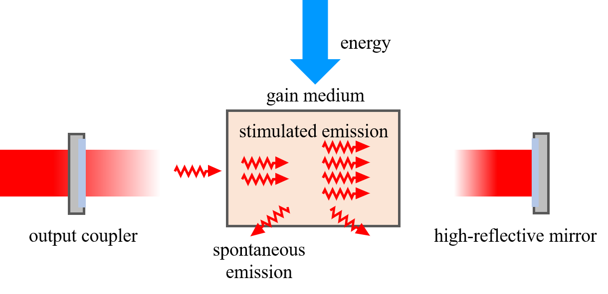

# Laser-Field-Simulation
Simulation of self-reproducing field pattern in the laser resonant cavity.

---

## Theories

The process of the laser propagating distance 'z' once in the resonant cavity can be described by the Fresnel diffraction function:

$$
U(x,y,z)=\frac{\mathrm{e}^{jkz}}{\mathrm{j}\lambda z}\iint_{-\infty}^{\infty}U(\xi,\eta,0)\exp\left\{\mathrm{j}\frac{k}{2z}[(x-\xi)^2+(y-\eta)^2]\right\}\mathrm{d}\xi\mathrm{d}\eta
$$

And it can be rewritten in to a convolution form:

$$
U(x,y,z)=\frac{e^\mathrm{jkz}}{jz\lambda}U(x,y)*\exp[j\frac{k}{2z}(x^{2}+y^{2})]
$$

In this case, if the size of the image is large enough, the diffraction function can be approximated by discrete convolution.

Meanwhile, due to the size of the reflector, the process of passing through the reflector can be considered as passing through a spatial filter. And the reflector is essentially a phase converter, whose transformation function is:

$$
t_{l}\left(x,y\right) =\exp\left[-\mathrm{j}{\frac{k}{2f}}(x^{2}+y^{2})\right]
$$

The above are all the processes that can be experienced by laser propagation in the resonant cavity.

The simplified structure of resonant cavity:



Simulation results of the transverse mode in a resonant cavity of a planar square mirror with an initial light field in the shape of a triangle:


## Requirements

```python
# Necessary
numpy
scipy
matplotlib

# Optional (For Making GIFs)
cv2
imageio
```
